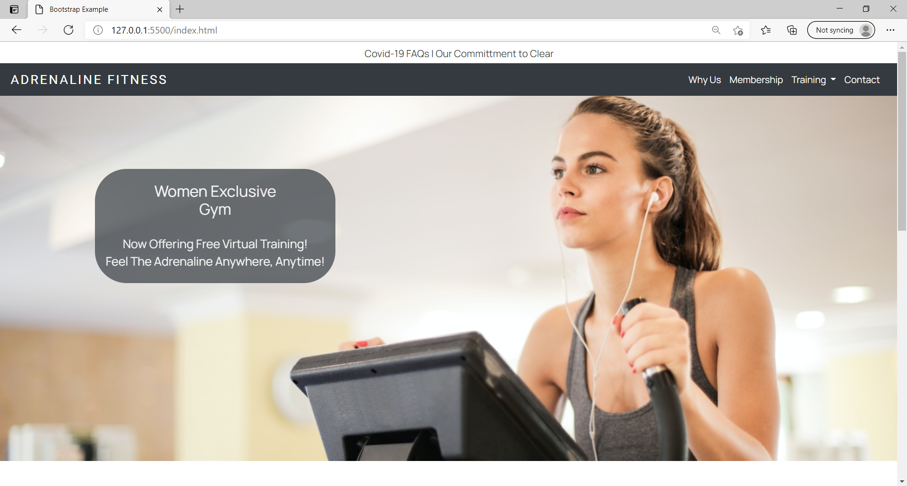

# Adrenaline Fitness

[Live Project Here](https://dariocharles.github.io/gym_project/)

Note: This is a project with the Canadian Business School’s Full Stack Software Development course 2021 and is a four page website containing a home, about, membership, contact pages. Other features beyond this scope of the project are not created. 

This is the main marketing website for Adrenaline Fitness. It is designed to be responsive and accessible on a range of devices, making it easy to navigate for potential clients. 

## Goals

### Business Goals
The business's goals for this website are to build their brand, engage with their target audience and bring traffic to their social media accounts. I have done this by making the website informative and easily navigated in order to ensure a quality user experience as well as with the style choices that. T

### User Goals
The user's goals when coming to this website are to quickly find information they are looking for.

### Developer Goals
My intention for building this website is to practice my design skills and technical skills to build a four page coherent website. My goals were to make the website responsive and to implement HTML, CSS, and Bootstrap together while meeting the needs of the fictional business and potential clients. 

## User Experience UX
When to user comes to the website they will experience a easily navigated website with as few clicks as necessary that answers their questions and provide further contact information and social media outlets to engage with the company. The website has a strong brand with an exclusive, high-end feel that sparks an emotional connection with it's audience.

### Some user stories include:
   #### First Time Visitor Goals
        - As a First Time Visitor, I want to easily understand the main purpose of the site and learn more about the organization.
        - As a First Time Visitor, I want to be able to easily navigate throughout the site to find content.
        - As a First Time Visitor, I want to look for testimonials to understand what their users think of them and see if they are trusted. I also want to locate 
          their social media links to see their followings on social media to determine how trusted and known they are.
   #### Returning Visitor Goals
        - As a Returning Visitor, I want to find membership pricing and benefits.
        - As a Returning Visitor, I want to find the best way to get in contact with the organization with any questions I may have.
        - As a Returning Visitor, I want to find the Facebook Group link so that I can join and interact with others in the community.
   #### Frequent User Goals
        - As a Frequent User, I want to check to see updates on challenges and events planned

### Design

- Colour Scheme
    - The two main colours used are black and white which were chosen to give the website a professional, minimalist feel. 
- Typography
    - The Manrope font is used for the headers and the Roboto font is used for other with Sans Serif as the fallback font in case for any reason the font isn't being imported into the site correctly. Manrope and Roboto are clean fonts that can be easily read, so it is both attractive and appropriate.
- Imagery
    - The images used in this site are consistent with one another as well as the brand identity. The background hero image is designed to catch the user’s attention and immediately tell the user what the business is about. It also has a modern, uplifting feel appropriate for a fitness business. 
- Style
    - I choice rounded corners to give the website a warm feel.

### Wireframe
    I didn't have a clear image of starting this site beforehand because of my inexperience in design ideas. So I decided to opt out of wireframes and focus on exploring what was possible. For future website I will use wireframes as a tool for design when it is clear in my head of what I am designing, rather then the focus of this site which was how to use the technologies. 

## Features
   - Responsive on all device sizes
   - Interactive elements

## Technologies Used

### Languages Used
- HTML5
- CSS3

### Frameworks, Libraries & Programs Used

1.	[Bootstrap v4.1:](https://getbootstrap.com/docs/4.6/getting-started/introduction/)
  - Bootstrap was used to assist with the responsiveness and styling of the website.
2.	[Google Fonts:](https://fonts.google.com/)
  - Google fonts were used to import the 'Manrope' and ‘Roboto’ fonts into the style.css file which is used on all pages throughout the project.
3.	[Font Awesome:](https://fontawesome.com/)
  - Font Awesome was used throughout the website to add icons for aesthetic and UX purposes.
4.	[Git](https://git-scm.com/)
  -	Git was used for version control by utilizing the Visual Studio Code terminal to commit to Git and Push to GitHub.
5.	[GitHub:](https://github.com/)
  - GitHub is used to store the projects code after being pushed from Git.
6.	[BeFunky:](https://www.befunky.com/)
  - BeFunky was used to create the logo, resizing images and editing photos for the website.

## Testing

### Testing User Stories

1. First Time Visitor Goals
    - As a First Time Visitor, I want to easily understand the main purpose of the site and learn more about the organisation.
        -  Upon entering the site, users are automatically greeted with a clean and easily readable navigation bar to go to the page of their choice. 
        - The main points are made immediately with the hero image and text
    - As a First Time Visitor, I want to be able to easily be able to navigate throughout the site to find content.
        - The site has been designed to be fluid and never to entrap the user. Each page is designed to be short to ensure that the user doesn’t get lost within them. At the top of each page there is a clean navigation bar, each link describes what the page they will end up at clearly.
        - The navigation bar has a line under the active page so that the user always know which page they are on. 
    - As a First Time Visitor, I want to look for testimonials to understand what their users think of them and see if they are trusted. I also want to locate their social media links to see their following on social media to determine how trusted and known they are.
        - The testimonials are easily accessed through the navigation bar on the About page. 
        - Social media links are on the bottom of every page and unobstructed by other information so visually stands out.

2. Returning Visitor Goals
    - As a Returning Visitor, I want to find the membership pricing and benefits.
        - The navigation bar has an easily clickable link to the membership page.
    - As a Returning Visitor, I want to find the best way to get in contact with the organization with any questions I may have.
        - The navigation bar clearly highlights the "Contact" Page.
        - Here they can fill out the modal to send directly to the company website and are given the address and phone number to use if they choose.
        - The footer contains links to the organizations Facebook, Twitter and Instagram page.
        - Whichever link they click, it will be open up in a new tab to ensure the user can easily get back to the website.
    - As a Returning Visitor, I want to find the Facebook Group link so that I can join and interact with others in the community.
        - The Facebook Page can be found at the footer of every page and will open a new tab for the user and more information can be found on the Facebook page

3. Frequent User Goals
    - As a Frequent User, I want to check to see updates on challenges and events planned.
        - The user would already be comfortable with the website layout and can easily click the navigation bar to locate information.

### Further Testing
   - The Website was tested on Google Chrome, Internet Explorer, Microsoft Edge and Safari browsers.
    - The website was viewed on a variety of devices such as Desktop, Laptop, iPhone7, iPhone 8 & iPhoneX.
    - A large amount of testing was done to ensure that all pages were linking correctly.
    - I have used dev tools to test responsiveness for multiple screen sizes.
    - I used [W3C Markup Validation](https://validator.w3.org/) to validate HTML
    - I used [W3C CSS Validation](https://jigsaw.w3.org/css-validator/) to validate CSS.

## Known Bugs

# Questions for markers****
- Membership Benefits - The three columns are staying in the middle and I had to make a two column break point because they squeeze in so tightly. What I wanted was have one breakpoint from three columns to one columns. I'm not sure how to make the three columns use the space in the div on the sides. I feel this issue repeated itself a few times in this website and is something I will have to find someone to ask. So if you the marker read this, I hope to comment on what I am not doing correctly here. 
- I'm not sure if I used the images correctly for the about and contact pages. How can I make an image stay the same view for all responsive design. What is happening now is that the images are zoomed out when are the largest screen size and zoom in as get smaller. If it is meant to do this action for images in a banner, how do I position them so they are always looking good at all widths. 
-The hero image has the same issue as above. But didn't manage to make it look good in other screen sizes then laptop view. 
- I was having trouble positioning the text on the hero image. I wanted to have the text centered at smaller screen sizes and to on the left of the image on larger screen sizes as it is now. What is a simple way I could position the text responsively?

## Deployment

### GitHub Pages
The project was deployed to GitHub Pages using the following steps...
1.	Log in to GitHub and locate the GitHub Repository
2.	At the top of the Repository (not top of page), locate the "Settings" Button on the menu.
   - Alternatively Click Here for a GIF demonstrating the process starting from Step 2.
3.	Scroll down the Settings page until you locate the "GitHub Pages" Section.
4.	Under "Source", click the dropdown called "None" and select "Master Branch".
5.	The page will automatically refresh.
6.	Scroll back down through the page to locate the now published site link in the "GitHub Pages" section.

### Forking the GitHub Repository
By forking the GitHub Repository we make a copy of the original repository on our GitHub account to view and/or make changes without affecting the original repository by using the following steps...
1.	Log in to GitHub and locate the GitHub Repository
2.	At the top of the Repository (not top of page) just above the "Settings" Button on the menu, locate the "Fork" Button.
3.	You should now have a copy of the original repository in your GitHub account.

### Making a Local Clone
1.	Log in to GitHub and locate the GitHub Repository
2.	Under the repository name, click "Clone or download".
3.	To clone the repository using HTTPS, under "Clone with HTTPS", copy the link.
4.	Open Git Bash
5.	Change the current working directory to the location where you want the cloned directory to be made.
6.	Type git clone, and then paste the URL you copied in Step 3.
$ git clone https://github.com/YOUR-USERNAME/YOUR-REPOSITORY
7.	Press Enter. Your local clone will be created.
$ git clone https://github.com/YOUR-USERNAME/YOUR-REPOSITORY
> Cloning into `CI-Clone`...
> remote: Counting objects: 10, done.
> remote: Compressing objects: 100% (8/8), done.
> remove: Total 10 (delta 1), reused 10 (delta 1)
> Unpacking objects: 100% (10/10), done.

## Credits

### Code
•	   Navbar - [Bootstraps 4.6 navbar template](https://getbootstrap.com/docs/4.6/components/navbar/) 
•	   Alert - [Bootstraps 4.6 alert code](https://getbootstrap.com/docs/4.6/components/alerts/) 
•	   Modal - [Bootstrap Popup Email Form](http://reusableforms.com/d/p/bootstrap-popup-email-form)	
•	   Modal button centering - [Vertical Align](https://www.w3schools.com/howto/howto_css_center-vertical.asp)
•	   Carousel - [Bootstrapious](https://jsfiddle.net/bootstrapious/tqagdo0z)

### Content
   - Reused content from [Anytime Fitness](https://www.anytimefitness.com/membership/)
   - All other content was written by the developer.

### Media
   - All Images were taken from [Pexels](pexels.com)
	        [Hero image](https://www.pexels.com/photo/photo-of-woman-using-earphones-3757954/)
	        [About](https://www.pexels.com/photo/woman-in-gray-tank-top-holding-two-black-dumbbells-3757370/)
            [Contact Img](https://www.pexels.com/photo/photo-of-woman-wearing-grey-sports-bra-3757374/)

### Acknowledgements
   - My teacher at Canadian Business College for assisting me to get to this place of building my first website. 
   - The Code Institute for providing course material to assist in learning how to implement the contents of this website

